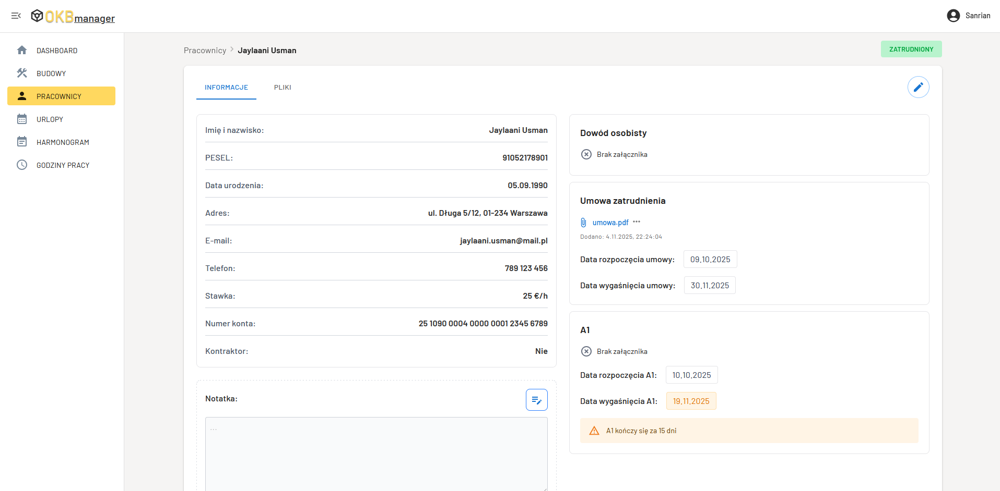

# OKB Manager

[](https://okb-manager-demo.vercel.app/)

**OKB Manager** is a comprehensive web-based management tool designed to streamline key operations in small construction companies. Built with a modern React/TypeScript stack and powered by Supabase, it centralizes resource management, reducing administrative overhead and increasing daily efficiency.



## Key Features

- **Employees Database:** Manage personnel details, contracts, and certifications.
- **Constructions Database:** Track active building sites, locations, and assigned contractors.
- **Work Schedule & Time Tracking:** Plan daily schedules and log timesheets (Work Logs) seamlessly. Print work hour reports.
- **Leave Calendar (PTO Tracker):** Manage vacations and absences with an intuitive calendar interface.
- **Event calendar:** plan events related to construction sites and employees.
- **Accommodation Manager:** Organize and assign lodging for deployed workers.
- **Document Management & File Storage:** Securely store and access important company and employee files.
- **Multilingual**: Fully supported English and Polish languages.
- **Dark/Light Mode:** Toggle between themes for a comfortable viewing experience.

## Technologies

- **Frontend:** React 19, TypeScript (v5.8), Vite, Material UI (MUI)
- **Backend & Database:** Supabase (PostgreSQL, Storage, Edge Functions, Auth)

## Preview

A live preview of the application running in Demo Mode (using an in-memory mock database) is available here:

**[okb-manager-demo.vercel.app](https://okb-manager-demo.vercel.app/)**

# Setup

## 1. Prerequisites

- **Node.js** (v18+ recommended)
- **npm**
- **Docker** (optional, but required if you want to run the local Supabase environment)

## 2. Environment Variables

The repository includes an `env.example` file with all the necessary configuration keys. To set up your local environment, copy this file and rename it to `.env`, then fill in your specific values:

**Required variables include:**
- `VITE_SUPABASE_URL`
- `VITE_SUPABASE_ANON_KEY`
- `VITE_COMPANY_NAME`
- `VITE_SHOW_DISK_USAGE`
- `VITE_FILES_BUCKET_NAME`
- `VITE_PUBLIC_BUCKET_NAME`
- `VITE_USE_MOCK`

### Important Note on Storage Buckets
The default database migration automatically creates two storage buckets:
*   `files` - a private bucket for secure attachments.
*   `system` - a public bucket for publicly accessible assets (e.g., policy documents).

You should assign these exact names (`files` and `system`) to `VITE_FILES_BUCKET_NAME` and `VITE_PUBLIC_BUCKET_NAME` in your `.env` file to match the database structure.

## 3. Running the Project for the First Time

1. **Go to frontend catalog:**
   ```
   cd frontend
   ```

2. **Install dependencies:**
   ```bash
   npm install
   ```

3. **Start the development server:**
   ```bash
   npm start
   ```
   *(This uses `vite --host` to expose the app on your local network).*

4. **Connect to the app in your browser:**
    ```
    http://localhost:5173/home
    ```

## 4. Demo Mode (Mock Database)

If you want to test the application or run it without connecting to an actual Supabase backend, you can enable the "Demo Mode". This uses an in-memory mock database.

To enable it, simply set the following flag in your `.env` file:
```env
VITE_USE_MOCK=true
```
When this flag is active, the app will bypass Supabase authentication and API calls, allowing you to freely explore the UI and features.

**File management does not work in this mode.**

## 5. Database Setup (Supabase)

You can run the backend either locally via Docker or connect it to a remote Supabase project.

### Running Supabase Locally (Recommended for Development)

1. Ensure **Docker Desktop** is running on your machine.
2. Start the local Supabase containers using:
   ```bash
   npx supabase start
   ```
3. Once initialized, the terminal will print your local `API URL` and `anon key`. Copy these into your `.env` file as `VITE_SUPABASE_URL` and `VITE_SUPABASE_ANON_KEY`.
4. The local setup automatically applies all database migrations to your Docker containers.
5. To stop the containers when you're done, run:
   ```bash
   npx supabase stop
   ```

### Deploying Migrations to an Existing Remote Supabase

If you have an existing Supabase project in the cloud and want to apply the database schema (tables, RLS, buckets) to it:

1. Log in to the Supabase CLI:
   ```bash
   npx supabase login
   ```
2. Link your local repository to the remote project:
   ```bash
   npx supabase link --project-ref <your-project-id>
   ```
3. If the remote database already has some tables created manually via the UI that match the initial migration, you must mark the migration as applied to avoid conflicts:
   ```bash
   npx supabase migration repair --status applied <timestamp_of_migration>
   ```
4. Push any new/remaining migrations to the remote database:
   ```bash
   npx supabase db push
   ```

## 6. Additional Features: 

###   Server Disk Usage Widget

The application includes an optional dashboard widget that displays the current disk usage of your server/VPS. 

To enable this feature:
1. Set the flag in your `.env` file:
   ```env
   VITE_SHOW_DISK_USAGE=true
   ```
2. Deploy the Edge Function:

    This feature relies on a Supabase Edge Function named `disk-usage`. You must deploy it to your Supabase instance:
   ```bash
   npx supabase functions deploy disk-usage
   ```
3. Adapt to your use case: 

    The default `disk-usage` function is built to communicate with the hosting provider's API. *You must adapt the source code inside `supabase/functions/disk-usage/index.ts` to match your specific hosting provider's API.*
4. Remember to set the required API secrets (e.g., VM IDs, API Tokens) in your Supabase project settings for the function to work correctly.